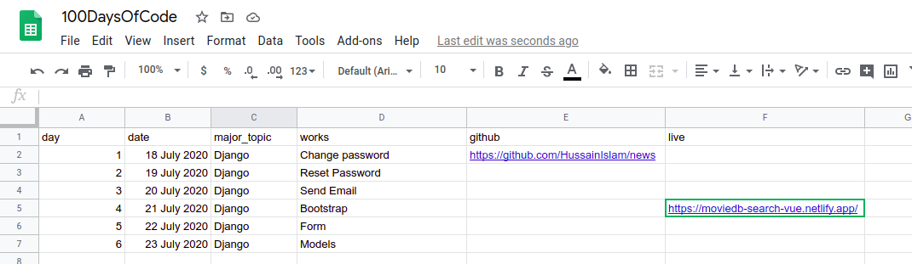
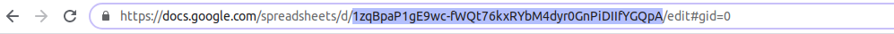

# 100 Days of Code Journal

## Introduction
This is a journal template that tracks the #100DaysOfCode challenge. This journal uses Google Sheet as database. So, anyone who doesn't have the skills to create/maintain a database can utlizie this with very low lead time. With this code base any use can create their own journal and display to the world. 

## Requirement
* Google Account and ability to create Google Sheet
* A hosting platform (I am using [Netlify](https://www.netlify.com/))
* Ability to type small commands

## How to use
1. Clone this repository (you can use `git clone <url>` command to clone or just `Download ZIP`)
   
   

2. Create a Google Sheet similar to the model provided below
   1. Open Google Sheet. [Click Here](https://docs.google.com/spreadsheets/)
   2. Create a `Blank` document
   3. Name it whatever you want
   4. Make sure your Spreadsheet have the following columns:
      1. **day**: This represents the day number
      2. **date**: This repesents the date
      3. **major_topic**: The major topic/criteria of the coding
      4. **works**: What you have done
      5. **github**: Link to the github repository, if any. Sample: `https://www.github.com/anything/`
      6. **live**: Link to live demo of the code. Sample: `http://www.netlify.com/anything/`
   5. Input information in these fields as required

    
   

3. Create `.env` file with required details. Sample provided in file `env_SAMPLE`.
   1. Open the newly created Spreadsheet
   2. Publish the Spreadsheet to web

   3. Copy the key of the Spreadsheet from the address bar of the browser (while you have the spreadsheet open).
    

   4. Open the `env_SAMPLE` file in the downloaded repository
   5. Paste the copied key infront of `REACT_APP_GOOGLE_SHEET_KEY`
   6. Save
1. Build and host!!
   1. Build your project with this command: `yarn build` or `npm run build`. This should create a new directory in the project called `build`. 
   2. You use the files in `build` directory to host this website.

## Hosting the app
There are few free web hosting platform that you can utilize:
* [Netlify](https://www.netlify.com/blog/2016/07/22/deploy-react-apps-in-less-than-30-seconds/)
* [GitHub Pages](https://dev.to/yuribenjamin/how-to-deploy-react-app-in-github-pages-2a1f)
* [Heroku](https://medium.com/better-programming/how-to-deploy-your-react-app-to-heroku-aedc28b218ae)

